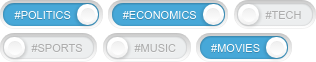

WonderPush Web SDK plugin to present the user with a switch she can use to tag herself, like subscribing to a category of push notifications.

Here is a screenshot of an example use of this plugin:

<center>

</center>

You can place them anywhere you see fit in your page, for instance near the beginning or ending of articles, or in menus.

# How to use this plugin

## From the WonderPush dashboard

Log in to your [WonderPush dashboard](https://dashboard.wonderpush.com/) and head over to the _Settings / Configuration_ page in the left menu.
Select the _Website_ tab and use this plugin. (available soon)

## From the initialization options of the SDK

Change your call to `WonderPush.init()` to include the following, merging existing keys as necessary:

```javascript
WonderPush.init({
  plugins: {
    "tag-switch": {
      // You can add any option to customize the plugin if needed
    },
  },
});
```

You can find the reference of the options in the {@link TagSwitch.Options} section of the reference.

## Placing some switches in your page

When loaded, the plugin looks for placeholder elements like the following, and fleshes them out to beautiful switches:

```xml
<!-- For manipulating tags -->
<div class="wonderpush-tag-switch" data-tag="sports" data-label="#sports"></div>
<!-- For manipulating properties -->
<div class="wonderpush-tag-switch" data-field="string_follow" data-value="sports" data-label="#sports"></div>
```

# Reference

The available API is described on the {@link TagSwitch} class.

The available options are described in the {@link TagSwitch.Options} section of the reference.
Most likely you will only need to use the `data` attributes on the placeholders, not the plugin's options.
